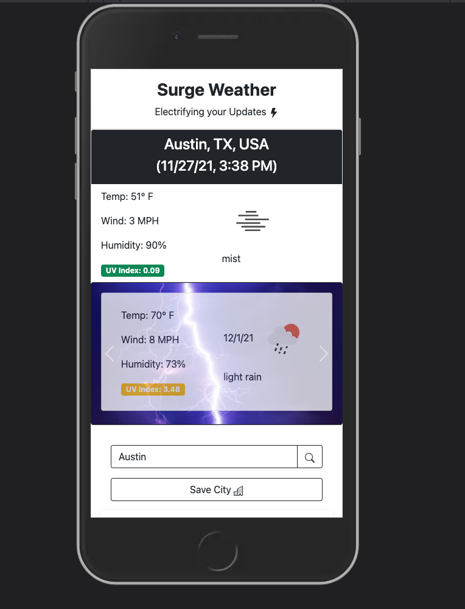

    
# Surge Weather

## License

## Description
    
A lightning themed mobile-first Dynamic Weather web-app, where users can search for the current weather by city (along with the 5-day forecast), and save search history.

## Screenshot

        

## Table of Contents

* [Installation](#installation)
* [Usage](#usage)
* [Credits](#credits)
* [License](#license)
* [Tests](#tests)
* [Questions](#questions)
    
## Installation

clone the repo, open index.html in your browser from your code editor

## Usage

Search by locality (city), and save cities as desired. Saved cities are represented by 'clickable' buttons in the 'Saved Cities" accordion, and when clicked, fetches the most current weather data for that city.

## Credits

* Photo by <a href="https://unsplash.com/@felix_mittermeier?utm_source=unsplash&utm_medium=referral&utm_content=creditCopyText">Felix Mittermeier</a> on <a href="https://unsplash.com/?utm_source=unsplash&utm_medium=referral&utm_content=creditCopyText">Unsplash</a>
  

## Contributing

## Tests
no current test method

## Questions

Please send additional questions to [@coderjake91](https://github.com/coderjake91), email: jacob.b.frazer@gmail.com